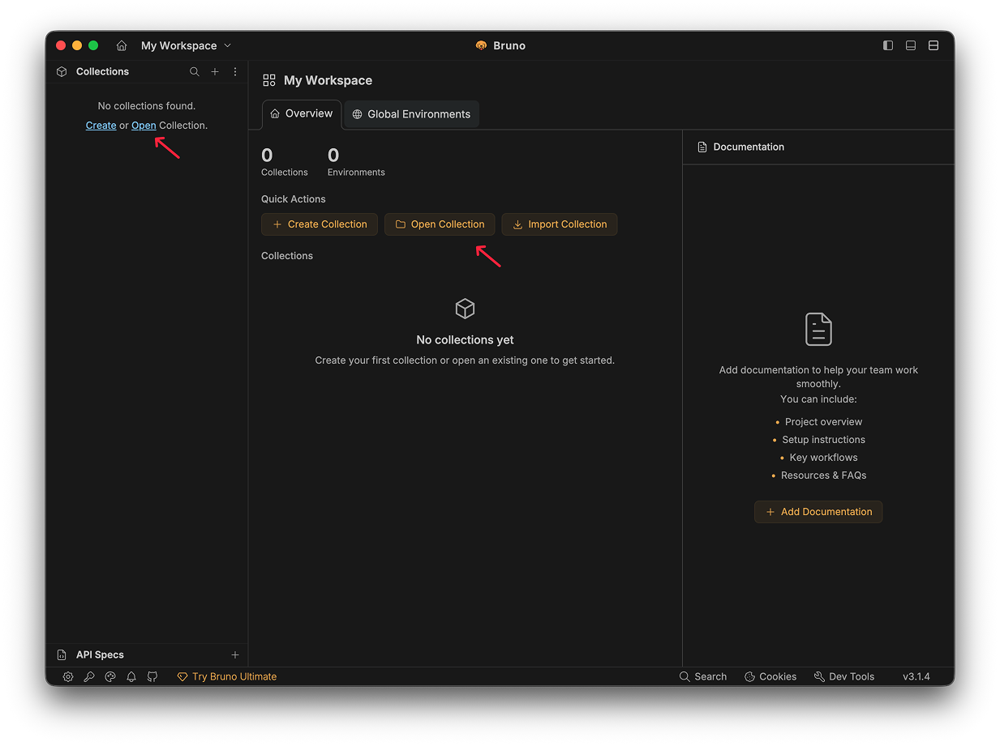
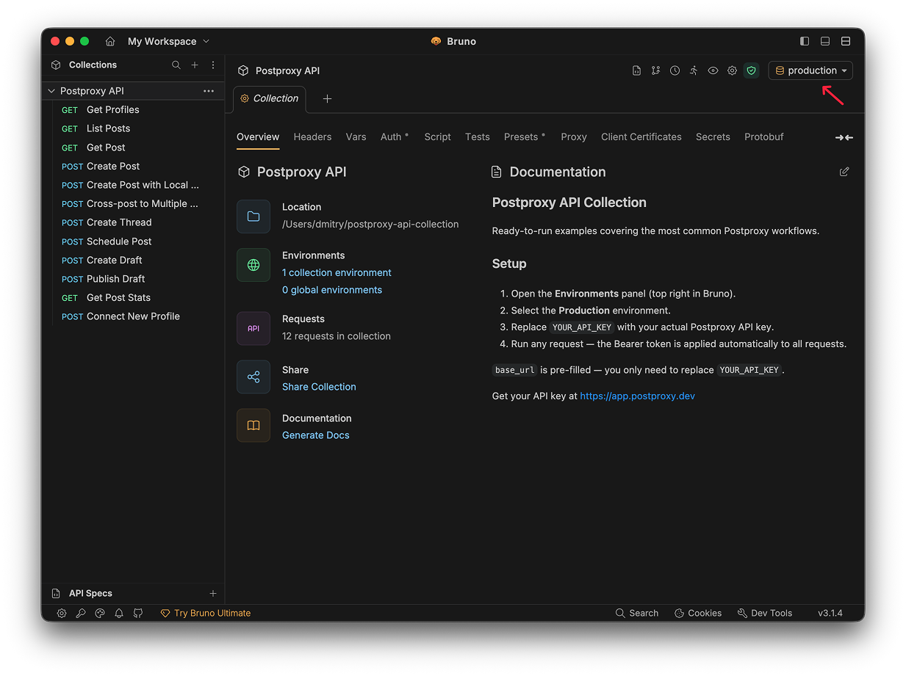
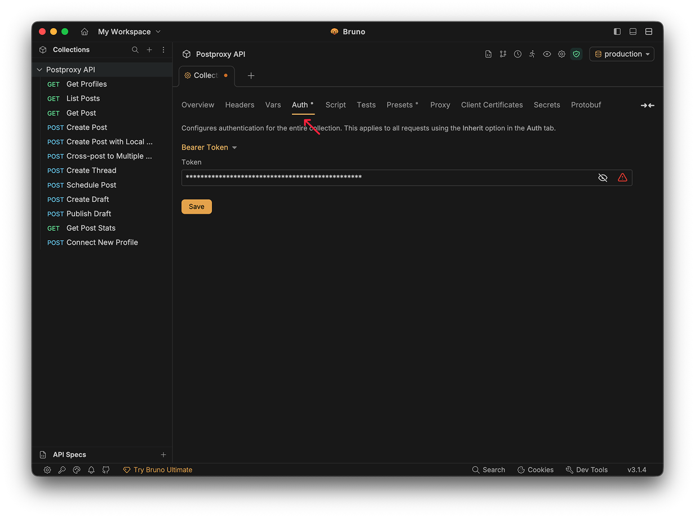
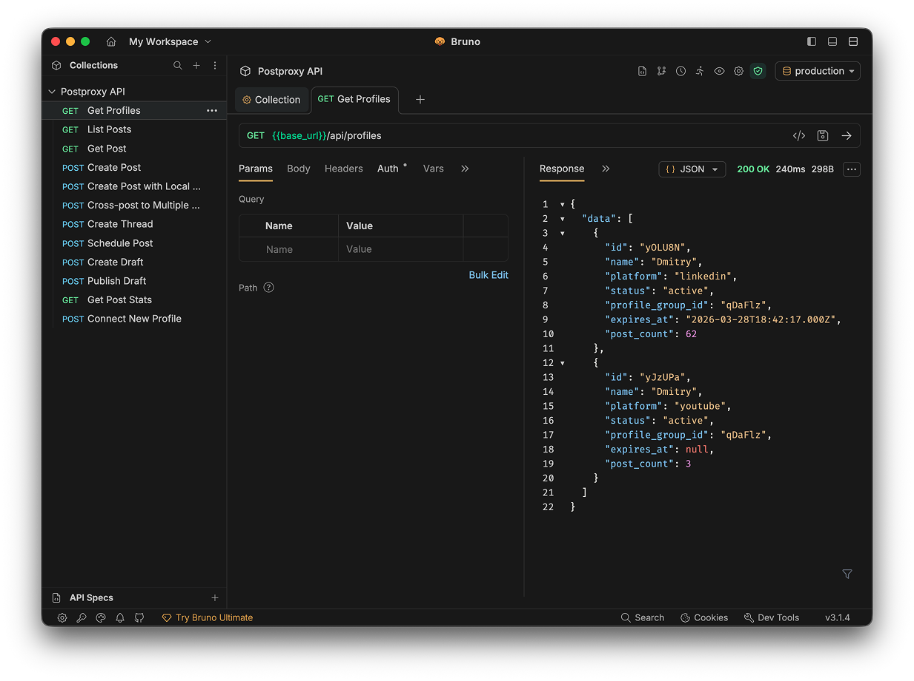

# Postproxy API Collection

[](https://fetch.usebruno.com?url=https://github.com/postproxy/postproxy-api-collection.git)

Ready-to-run API examples for [Postproxy](https://postproxy.dev) — covering the most common workflows from connecting profiles to publishing posts across multiple platforms.

Built with [Bruno](https://www.usebruno.com/) using the [OpenCollection YAML](https://docs.usebruno.com/opencollection-yaml/overview) format.

---

## Quick start

Requires Bruno 3.1.0 or later — [download here](https://www.usebruno.com/downloads).

**1. Open the collection**

Clone this repo, then open Bruno → **Open Collection** → select the cloned folder.

```bash
git clone https://github.com/postproxy/postproxy-api-collection.git
```



**2. Select the Production environment**

Click the environment selector in the top-right corner and choose **production**.



**3. Add your API key**

Go to the **Collection** tab → **Auth** → paste your Postproxy API key into the Bearer Token field and save.



Get your API key at [app.postproxy.dev](https://app.postproxy.dev).

**4. Run a request**

Select **Get Profiles** and hit send. You should see your connected social accounts in the response.



---

## What's included

| # | Request | Description |
|---|---------|-------------|
| 01 | Get Profiles | List all connected social accounts — good first request to run |
| 02 | List Posts | Paginated list of your posts with platform status and insights |
| 03 | Get Post | Full details for a single post including media and engagement |
| 04 | Create Post | Publish a post with an image URL to a single platform |
| 05 | Create Post with Local File | Upload a file from your computer using multipart form |
| 06 | Cross-post to Multiple Platforms | Post to YouTube, TikTok, and Instagram with per-platform params |
| 07 | Create Thread | Multi-part thread for X (Twitter) and Threads |
| 08 | Schedule Post | Publish at a specific future time using `scheduled_at` |
| 09 | Create Draft | Save a post without publishing — step 1 of 2 |
| 10 | Publish Draft | Publish a saved draft — step 2 of 2 |
| 11 | Get Post Stats | Engagement metrics (impressions, likes, etc.) for one or more posts |
| 12 | Connect New Profile | Generate an OAuth URL to connect a new social account |
| 13 | Create Comment | Post a comment on one of your published posts |
| 14 | Reply to Comment | Reply to an existing comment using `parent_id` |

---

## Authentication

Bearer token auth is configured once at the collection level (**Collection → Auth**). All requests use `auth: inherit`, so every request automatically sends the token you set there.

---

## Resources

- [Postproxy Documentation](https://postproxy.dev/getting-started/overview/)
- [API Reference](https://postproxy.dev/api-reference/overview/)
- [Examples](https://postproxy.dev/getting-started/examples/)
- [Bruno](https://www.usebruno.com/)
